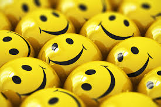
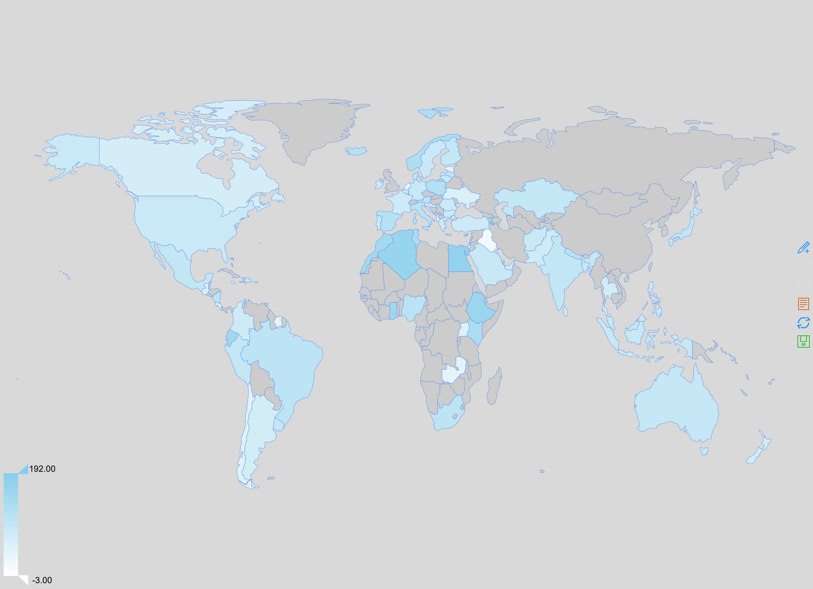

```{r setup, include=FALSE}
knitr::opts_chunk$set(echo = TRUE)
```



"Happiness is the only thing that humans desire for its own sake." said by the great philosopher Aristotle in the Nicomanchean Ethics. I feel happy because I saw a beatiful cat on the street, or I ate a delicious pumpkin pie made by my friend Jessica, or maybe I just stayed at home for a whole day relaxing and doing nothing, and it made me happy. The reasons for happiness can be vairous, but what exactly can make people happy? When people say they're happy, what kind of emotions do they actually feel? Does the cause of happiness differ for different kinds of people? Let's find out the answers by analyzing the [HappyDB](https://rit-public.github.io/HappyDB/) dataset, where 100,000 happy moments are recorded!

##What do happy moments look like?

```{r load library, include=FALSE}
#load the required packages
library(tm)
library(tidytext)
library(tidyverse)
library(DT)
library(vcd)
library(shiny)
library(ngram)
library(RColorBrewer)
library(gridGraphics)
library(gridExtra)
library(wordcloud)
library(sentimentr)
library(qdap)
library(syuzhet)
library(d3heatmap)
library(topicmodels)
library(REmap)
library(factoextra)
```

```{r read data, warning=FALSE, message=FALSE,echo=FALSE}
#the generation process of the files are not inclued in this R markdown file due to the running time of data processing
#to check the file generation process, refer to "Generate_output+files.R" 
urlfile<-'https://raw.githubusercontent.com/rit-public/HappyDB/master/happydb/data/demographic.csv'
demo_data <- read_csv(urlfile)
hm_data<-read_csv("../output/processed_moments.csv")
vad_data<-read_csv("../data/vad.csv")
sentence.data<-read.csv("../output/sentence.csv",as.is=T)
sense_data<-read_csv("../data/senselabel.csv")

#combine demographic.cvs and the cleaned data(hm_data)
sel_data <- hm_data %>%
  inner_join(demo_data, by = "wid") %>%
  select(wid,
         original_hm,
         gender, 
         marital, 
         parenthood,
         reflection_period,
         age, 
         country, 
         predicted_category, 
         text) %>%
  mutate(count = sapply(hm_data$text, wordcount)) 
```

First, let's check the Happy Moments Decriptions and see how our happy moments differ from the routine moments by analyzing the complexity of sentences and the [emotional states](https://en.wikipedia.org/wiki/PAD_emotional_state_model) .

###Complexity of Sentences

With the 100,392 records of happy moments, we extract 139,760 sentences. On the one hand, each record will have 1.39 sentences and the records with only one sentence account for 83% of the total, which means that in most cases, happy moments are not long-lasting stories or hard to explain. Further, when we look into the sentences, we notice that only 16% of sentences have more than 20 words, which are considered as long sentences. Also compared to the length of sentence in general (10-20 words), most of our happy moments sentences have 5-15 words, which also shows that happy moments decriptions are shorter than general. 

Meanwhile, on the otherhand, when we look into the number of verbs in each sentence, we can find that 42% of sentences have 3 verbs of more. The number of verbs can be considered as one proxy for the complexity of sentences in HappyDB and the high proportion of multiple verbs in one sentence indicates that people express quite complex thoughts in their "short" moment.

```{r barplot_verbpersentence,echo=F}
#data processing to generate the bar plot of verbs per sentence
verb_data<-sense_data[sense_data$POS=="VERB",]%>%
  count(hmid)
verb_data<-verb_data%>%
  left_join(hm_data,by="hmid")%>%
  select(hmid,num_sentence,n)%>%
  na.omit%>%
  filter(num_sentence>0)%>%
  mutate(verbpersentence=floor(n/num_sentence))
vpers<-rep(verb_data$verbpersentence,verb_data$num_sentence)
vpers<-as.data.frame(table(vpers)[1:9])
colnames(vpers)<-c("number_of_verbs","density")
vpers$density<-as.numeric(vpers$density)
vpers$density<-round(vpers$density/sum(vpers$density),2)
#generate the bar plot of verbs per sentence
p2<-ggplot(data = vpers,aes(x=number_of_verbs,y=density,fill=number_of_verbs)) +
  geom_bar(stat="identity")+
  geom_text(aes(label = density, hjust = 0.5, vjust = 3)) +
  labs(title="Number of verbs per sentence")
```

```{r barplot_sentence,echo=FALSE,fig.align="center",fig.height=4,fig.width=10}
#data processing to generate the bar plot of words per sentence
wordinsen<-sentence.data$word.count
group<-c(seq(-1,30,by=5),150)
wordgroup=cut(wordinsen,breaks=group,labels=c("0-5","5-10","10-15","15-20","20-25","25-30","30-150"))
wpers<-as.data.frame(table(wordgroup))
colnames(wpers)<-c("number_of_words","density")
wpers$density<-round(wpers$density/sum(wpers$density),2)
#generate the bar plot of words per sentence
p1<-ggplot(data = wpers,aes(x=number_of_words,y=density,fill=number_of_words)) +
  geom_bar(stat="identity")+
  geom_text(aes(label = density, hjust = 0.5, vjust = 3)) +
  labs(title="Number of words per sentence")
#plot the 2 graphs
grid.arrange(p1, p2,layout_matrix=matrix(1:2,nrow=1,ncol=2))
```

###VAD Emotional States

Let's take a look on the VAD (also called PAD) socres of the happy moments. VAD model stands for Valence-Arousal-Dominance model ("P" in PAD stands for Pleasure), which provides a score for each lemmatized word on a scale of pleasure-displeasure (valence), excitement-calm (arousal), and control-inhibition (dominance). After computing the mean of each VAD score in the Happy Moments , and comparing this score to [the scores of the ten sections of Gardian corpus](https://www.sciencedirect.com/science/article/pii/S1877042813042109). We can see that HappyDB's VAD score is closer to VAD score of the travel section ($V\approx6.2, A\approx4.0, D\approx5.7$). In addition, every score in of Valence, Arousal and Dominance of HappyDB is larger than the corresponding highest socre of the ten sections, which is a quantative proof that when people express their happiness, they are highly pleased, excited and also self-dominant.

```{r vad,echo=F}
#for vad scores, we use the data in HappyDB named "vad.csv"
vad_data<-vad_data%>%
  summarise(
    valency=round(mean(valency,na.rm=TRUE),2),
    dominance=round(mean(dominance,na.rm=TRUE),2),
    arousal=round(mean(arousal,na.rm=TRUE),2))
datatable(vad_data)
```

##What makes people happy? How does it differ for different groups of people?

As mentioned above, happiness moment records do show a specific pattern and emotional state. Now, let's go deeper into it, to discuss what elements lead people to this highly emotional happiness and try to figure out different patterns of happiness for different kinds of people. 

###Data Overview

Let's first have a look on the distribution of our data.

```{r dataoverview, echo=F,warning=F,message=F,fig.align="center",fig.height=10,fig.width=10}
#generate plot of Gender Distribution
p1<-ggplot(data = sel_data[!is.na(sel_data$gender),],aes(x=gender)) +
  geom_bar(mapping = aes(x = gender),fill=brewer.pal(3,"Set2")) +
  geom_text(aes(x = gender, label = ..count..), stat = "count", vjust = -0.1)+
  labs(title="Gender Distribution")
#generate plot of Marital Distribution
p2<-ggplot(data = sel_data[!is.na(sel_data$marital),]) +
  geom_bar(mapping = aes(x = marital),fill=brewer.pal(5,"Set2")) +
  geom_text(aes(x = marital, label = ..count..), stat = "count", vjust = -0.1)+
  labs(title="Marital Distribution")
#generate plot of Parenthood Distribution
p3<-ggplot(data = sel_data[!is.na(sel_data$parenthood),],aes(x=parenthood)) +
  geom_bar(mapping = aes(x = parenthood),fill=c("coral1","darkseagreen3")) +
  geom_text(aes(x = parenthood, label = ..count..), stat = "count", vjust = -0.1)+
  labs(title="Parenthood Distribution")
#generate plot of Parenthood Distribution
agenum<-as.numeric(sel_data$age)
age_data<-sel_data[!is.na(agenum),]
p4<-ggplot(data = age_data, aes(x = as.numeric(age), y = ..density..)) +
  geom_histogram(bins = 100,fill="chocolate2") +
  scale_x_continuous(limits = c(15,90))+
  xlab("age")+
  labs(title="Age Distribution")
#plot the 4 graphs
grid.arrange(p1, p2,p3,p4,layout_matrix=matrix(1:4,nrow=2,ncol=2))
```

```{r countrycount, echo=F}
#plot the country where HappyDB come from
countryc<-table(sel_data$country)%>%na.omit
countryc<-as.data.frame(countryc[order(countryc,decreasing = T)])
colnames(countryc)<-c("Country","Number of records")
datatable(countryc)
```

We can see that in the HappyDB data, we have more male data(57%) than female(43%), more nonparent data (61%) than parent data(39%), more single data(54%) than married data(41%). The workers are mainly between 20 years old to 40 years old. Speaking to the distribution of countries, USA contributes to 79% of the data, the next is India(17%), it seems that it lacks data from Russia and China, which contribute to a large proportion of population. 

Now we have a general idea of what do our data come from. Let's try to figure out what contribute to happiness!

###Words frequently used

As we would like to identify interesting words for each inaugural speech, we use [TF-IDF](https://en.wikipedia.org/wiki/Tf%E2%80%93idf) to weigh each term within each speech. It highlights terms that are more specific for a particular speech. Then we plot the wordcloud for the whole HappyDB data.

```{r data processing for wordcloud, echo=F}
#tfidf
corpus <- VCorpus(VectorSource(hm_data$text))
happy_dtm_tfidf <- DocumentTermMatrix(corpus, control = list(weighting = function(x) weightTfIdf(x,normalize =FALSE), stopwords = TRUE))
happy_dtm_tfidf = removeSparseTerms(happy_dtm_tfidf, 0.99)
freq = data.frame(sort(colSums(as.matrix(happy_dtm_tfidf)), decreasing=TRUE))
```

```{r wordcloudplot1, fig.align="center",fig.height=5,fig.width=5,echo=FALSE}
#plot wordcloud
wordcloud(rownames(freq), freq[,1], max.words=90,min.freq = 3, rot.per=0.3,random.order=FALSE,scale=c(4,0.2),use.r.layout=T,colors=brewer.pal(8,"Set1"))
```

As we can see, "friend" is the most frequently used word in Happy Moments and the words regarding prople, such as "family", "son", "daughter" are also a great focus. Verbs like "feel", "played", "watched", "enjoyed", "bouthgt" and "received" will be another category of words that appears a lot in HappyDB.

So, according to the wordcloud, we are happy mainly because of the people around us and the cheerful actions in our past 24 hours or 3 months. Naturally, we also want to know if the word focus of these 2 catrgories (24 hours relflection period and 3 months) differ from each other. Let's compare the wordcloud for 24 hours(24h) reflection period (left), and for 3 months(3m) reflection period (right). 

```{r wordcloudplot2, echo=F,fig.height=6.5,fig.width=12,echo=FALSE}
par(mfrow=c(1,2))
#wordcloud of 24hours reaction
corpus <- VCorpus(VectorSource(hm_data[hm_data$reflection_period=="24h",]$text))
happy_dtm_tfidf <- DocumentTermMatrix(corpus, control = list(weighting = function(x) weightTfIdf(x,normalize =FALSE), stopwords = TRUE))
happy_dtm_tfidf = removeSparseTerms(happy_dtm_tfidf, 0.99)
freq = data.frame(sort(colSums(as.matrix(happy_dtm_tfidf)), decreasing=TRUE))
wordcloud(rownames(freq), freq[,1], max.words=70,min.freq = 3, rot.per=0.3,random.order=FALSE,scale=c(4,0.2),use.r.layout=T,colors=brewer.pal(8,"Set1"),main="24 hours")
#wordcloud of 3months reaction
corpus <- VCorpus(VectorSource(hm_data[hm_data$reflection_period=="3m",]$text))
happy_dtm_tfidf <- DocumentTermMatrix(corpus, control = list(weighting = function(x) weightTfIdf(x,normalize =FALSE), stopwords = TRUE))
happy_dtm_tfidf = removeSparseTerms(happy_dtm_tfidf, 0.99)
freq = data.frame(sort(colSums(as.matrix(happy_dtm_tfidf)), decreasing=TRUE))
wordcloud(rownames(freq), freq[,1], max.words=70,min.freq = 3, rot.per=0.3,random.order=FALSE,scale=c(4,0.2),use.r.layout=T,colors=brewer.pal(8,"Set1"))
```

For both of these 2 wordclouds, it follows the same pattern with the wordcloud in general. However, we can see that, for 24h reflection period, the verbs like "watched", "played", "enjoyed" appear much more often than for 3m reflection period, whereas the words like "job", "school", "life" appear more for 3m reflection period. Further, the 24m reflection period focus more on "dinner", "lunch", food", "delicious" and 3m reflection period focus more on "birthday" or "event".

It seems that for 24h reflection period, people tend to focus more on instant happiness like "played a game" or "had a delicious food". Regarding the 3m reflection period, people tend to focus on long-term happiness such as "job", "school" or special ecents, such as "birthday". This makes sense, because if the reflection period is only 24hours, people will more often state out the daily happy moments. We could also deduce that if one is asked to state out his/her happy moments in his/her whole life, the possible answer will be something more infrequnetly happens, such as marriage, birth of child, first job...

###Categories of happiness

HappyDB provides us the happy moments with a predicted category which is one of achievement, affection, bonding, enjoy_the_moment, exercise, leisure and nature.

```{r pie plot,echo=FALSE,warning=FALSE,fig.align="center"}
#pie plot of categories
par(mfrow=c(1,1))
t<-sort(table(sel_data$predicted_category))
type<-names(t)
nums<-unname(t)
df<-data.frame(type,nums)
df<-df%>%
  select(type,nums=Freq)
col.use=brewer.pal(7, "Set2")
label_value <- paste('(', round(t/sum(t) * 100, 1), '%)', sep = '')
label <- paste(df$type, label_value, sep = '')
ggplot(data=df,mapping=aes(x="Content",y=nums,fill=label))+
  geom_bar(stat="identity",position="stack")+
  coord_polar(theta="y")+
  scale_fill_manual(values=col.use)+
  labs(x = '', y = '', title = '')+
  theme(axis.text = element_blank())
```

"Affection" and "achievement" accounts for 67.8% of the whole happiness categories, which shows that our happiness come mainly from the interaction with loved ones and success in jobs, schools or some thing with great effort. 

Let's see how this category distribution varies from different age groups.

```{r splitage,echo=FALSE,warning=FALSE}
group<-c(1,seq(17,87,by=10),98)
age_data$age<-as.numeric(age_data$age)
age_data<-age_data%>%
  select(age,predicted_category)%>%
  filter(age<100)%>%
  mutate(agegroup=cut(age,breaks=group,labels=c("2-4","17-27","27-37","37-47","47-57","57-67","67-77","77-87","87-98")))%>%
  count(agegroup,predicted_category)%>%
  spread(predicted_category,n)
```

```{r stackplot,echo=FALSE,fig.align="center"}
age_data[is.na(age_data)]<-0
age_data<-gather(age_data,attribute,value,-agegroup)
age_data<-as.data.frame(age_data)
age_data2 <- data.frame(category = as.numeric(as.factor(age_data$attribute)),
                          freq = age_data$value,
                          age = age_data$agegroup)
ggplot(age_data2, aes(x=category, y=freq, fill=age)) + 
    geom_area() +
  scale_x_continuous(breaks=seq(1, 7, 1),
        labels=names(table(age_data$attribute)))
```

As the plot shows, people aged 27-37 have a greater focus on affection compared to people aged 17-27 which in turn have a greater focus on achievement. It might because at the age of 17-27, people are younger thus more willing and ambitious to prove themselves, leading to a higher emphasis on achievement, whereas people aged 27-37 would probably be already settled and more likely to be married thus put more emphasis on affection.

Let's compare the category of happiness in other groups.

```{r mosaic plot,echo=FALSE,warning=FALSE,fig.align="center"}

mosaic(~predicted_category+marital,data=sel_data,highlighting="marital",,highlighting_fill=c("brown","pink","brown3","lightblue","coral4"),labeling= labeling_border(varnames=c(F,F),rot_labels = c(90,0,90,0), just_labels = c("left", "right", "right", "right")),margins=unit(4.7,"lines"))

```

The happiness of married people come from affection more than achievement. Although we have more single data than married data as mentioned before, within the happy moments classified as afection, the proportion of married people exceed the proportion of single people. For single people, compared to the married people, they will put more emphasis on exercise, bongding and achievement.

We can conduct the same analysis on gender and parenthood. The mosaic plot shows that female puts more emphasis on affection and nature than male and parents put more emphasis on affection, nature and enjoy_the_moment than nonparents.

This is quite straightforward and we can expect these results. Because we expect women to be more emotional, and married people and parents to be more dedicated to their family, thus all of them would probably weigh affections more than achievement and their happiness might come from affections more.

```{r,include=FALSE,warning=F}
mosaic(~predicted_category+gender,data=sel_data,highlighting="gender",,highlighting_fill=c("pink","lightblue","black"),labeling= labeling_border(labels=c(F,T),varnames=c(F,T),rot_labels = c(0,90,90,0), just_labels = c("left", "right", "right", "right")),margins=unit(3,"lines"))
m<-grid.grab()
mosaic(~predicted_category+parenthood,data=sel_data,highlighting="parenthood",,highlighting_fill=c("pink","lightblue"),labeling= labeling_border(varnames=c(F,T),rot_labels = c(0,90,90,0), just_labels = c("left", "right", "right", "right")),margins=unit(3,"lines"))
a<-grid.grab()
```

```{r,echo=FALSE,warning=F,fig.height=4,fig.width=10}
grid.arrange(m,a,ncol=2)
```

##When people say they are happy, what kind of emotion do they actually feel?

Our happiness can be classified into different categories. But what happiness stands for? When people say they are happy, what do they actually feel? Satisfaction? Joy? Luck? To figure out this problem, we apply sentiment analysis using [NRC sentiment lexion](http://saifmohammad.com/WebPages/NRC-Emotion-Lexicon.htm), which is a list of English words and their associations with eight basic emotions (anger, fear, anticipation, trust, surprise, sadness, joy, and disgust) and two sentiments (negative and positive).

```{r echo=F,fig.align="center",fig.height=20}
## Summary emotions
happy.summary=tbl_df(sentence.data)%>%
  group_by(country)%>%
  summarise(
    anger=mean(anger,na.rm=TRUE),
    anticipation=mean(anticipation,na.rm=TRUE),
    disgust=mean(disgust,na.rm=TRUE),
    fear=mean(fear,na.rm=TRUE),
    joy=mean(joy,na.rm=TRUE),
    sadness=mean(sadness,na.rm=TRUE),
    surprise=mean(surprise,na.rm=TRUE),
    trust=mean(trust,na.rm=TRUE),
    negative=mean(negative,na.rm=TRUE),
    positive=mean(positive,na.rm=TRUE)
  )
happy.summary<-happy.summary[!is.na(happy.summary$country) ,]
countryname<-happy.summary$country
happyplot.summary<-data.matrix(happy.summary[,-1])
rownames(happyplot.summary)<-as.data.frame(countryname)[,1]

library(shiny)
div(d3heatmap(happyplot.summary, scale="none", colors= "Reds",
          xaxis_font_size = 8,Rowv = FALSE,Colv=FALSE,show_grid=TRUE,yaxis_font_size = 4 ),
    align='center')
```

The darker the orange is, the higher the score. Not surprisingly, HappyDB has a very high score in positive sentiments. Within the emotions, HAppyDB has higher scores in joy, anticipation ond trust. It is interesting that it does not score very high in "surprise", but score very high in "trust", because in my opinion, trust is rather a positive emotion that has less connection with happiness. This interesting fingding shows that people treat happiness more seriuosly: a single surprise would probably not be a source of happiness but a trust from deep heart will account for a freat part.

Let's see the positive socres of happy moments in different countries.

```{r mapplot,echo=F, warning=F,message=F}
countrycode2name<-read_csv("../data/countryname.csv")
data<-merge(happy.summary,countrycode2name,by.x="country",by.y="alpha-3")
data = data.frame(country = data[,12],
                   value = data[,11]*1000)
out<-remapC(data,maptype = "world",color = 'skyblue')
plot(out)
```



The darker the blue is, the higher the positive score. 

First we can see on the plot that a lot of data are missing, for example Russia, China, and a large part of African coutries, which cause a big impede in the analysis of HappyDB. In the future, if possible, we should collect more data from these countries. If we want to focus only on the analysis of HappyDB in USA, in the future investigation, we should also collect the state information for each worker.

Based on the data we have, we can see Algeria, Egypt and Ethiopia has a very high score of positive sentiment and they are all located in Africa. 
But the country with lower positive scores such as Uganda and Zambia are also in Africa, which means Africa's Happy Moments have a greater variance on positive sentiments. Notice the coutry with the lowest positive score in happiness is Iraq.

##How does the reason of happiness differ for people from different countries?

Let's go deeper in difference of happiness in different countries. We use the topic modelling to assign one of nine topics to each Happy Moments and obtain the topic score (probability) and try to cluster the countries by sentiment scores and topic scores.

```{r echo=F}

ldaOut.topics <- read.csv("../output/DocsToTopics.csv")

#top 20 terms in each topic
ldaOut.terms <- read.csv("../output/TopicsToTerms.csv")

#probabilities associated with each topic assignment

topic_data<-read.csv("../output/Topicswinfo.csv")[,-1]
topicProbabilities <-read.csv("../output/TopicProbabilities.csv")[,-1]
```

###9 Topics of Happy Moments

In the official HappyDB dataset, we are given a topic_dict file which gives us nine topics and their key words. So I try to use LDA to detect nine topics from HappyDB and assgin the topics according to topic_dict.

Below are the top 20 terms in each topic.

```{r echo=F}
datatable(ldaOut.terms)
```

After checking the top 20 terms and the nine topics in topic_dict file, I realize it is unreasonable to follow these nine topics strictly, since there are predicted topics that do not have any keywords in these nine topics, so I adjust some new topics by myself and the final nine topics are "love","school_job","people","food","family","shopping","vacation","entertainment" and "celebration".

Below are the topics with their numbers in HappyDB. "School_Job" and "Love" are the 2 main topics of HappyDB, which can be viewed as a counterpart of "Achievement" and "Affection" in the predicted categories.

```{r text processing,warning=F,echo=F}
topics.hash=c("love","school_job","people","food","family","shopping","vacation","entertainment","celebration")
topic_data<-topic_data[,c(1,3,5,8)]
topic_data<-tibble(wid=topic_data[,1],gender=topic_data[,2],parenthood=topic_data[,3],country=topic_data[,4])
topicProbabilities<-cbind(topicProbabilities,ldaOut.topics)
colnames(topicProbabilities)<-c(topics.hash,"wid","topics")
country.summary=tbl_df(topicProbabilities)%>%
  inner_join(topic_data, by="wid")%>%
  group_by(wid)%>%
  filter(row_number()==1)%>%
  ungroup()%>%
  group_by(country)%>%
  summarise(
    love=mean(love,na.rm=TRUE),
    school_job=mean(school_job,na.rm=TRUE),
    people=mean(people,na.rm=TRUE),
    food=mean(food,na.rm=TRUE),
    family=mean(family,na.rm=TRUE),
    shopping=mean(shopping,na.rm=TRUE),
    vacation=mean(vacation,na.rm=TRUE),
    entertainment=mean(entertainment,na.rm=TRUE),
    celebration=mean(celebration,na.rm=TRUE))%>%
  inner_join(happy.summary[table(sel_data$country)>50,],by="country")
country.topic<-apply(country.summary[,c(2:10)],1,which.max)
country.topic<-as.data.frame(cbind(country.summary[,1],country.topic))
dict.topic<-as.data.frame(cbind(1:9,topics.hash))
dict.topic$V1<-as.numeric(dict.topic$V1)
country.topic$country.topic<-as.numeric(country.topic$country.topic)
colnames(country.topic)<-c("country","topic")
country.topic<-merge(country.topic,dict.topic,by.x="topic",by.y="V1")
```

```{r echo=F,warning=F}
ldaOut.topics <- as.matrix(ldaOut.topics)
topiccount<-table(c(1:9, ldaOut.topics))
names(topiccount)<-topics.hash
topiccount<-topiccount[order(topiccount,decreasing = T)]
datatable(as.data.frame(topiccount))
```

Based on the average topic scores for each country, I assgined a topic to a certain coutry, to see that it focus most about happiness, for example, people in United States focus more on "people".

```{r echo=F, warning =F}
datatable(country.topic[,c(2,3)])
```

###Clustering of the countries

Now we have the sentiment scores and topic scores of different countries, let's try to cluster the countries into 3 groups! The countries considered in this part are the countries whose number of records are greater than 50 in HappyDB, otherwise, it will not be that informative.

```{r echo=F}
set.seed(111)
country.summary<-as.data.frame(country.summary)
rownames(country.summary)<-as.character((country.summary[,1]))
km.res=kmeans(scale(country.summary[,-1]), iter.max=200,3)
fviz_cluster(km.res, 
             stand=T, repel= TRUE,
             data = country.summary[,-1],
             show.clust.cent=FALSE)
```

From the above plot, we can see that Egypt are quite deviated from the overall pattern of the happy moments and Jamaica also deviates a lot but it is still considered as part of cluster 1. Egypt's main happy topic is about "family" and it has a relatively high score in sentiment analysis.

In cluster1, we also have Thailand, Dominicia, Bulgaria, Macedonia, Serbia and Portugal. Macedonia, Bulgaria and Serbia are closer to each other. So we might assume that the happy moments depends on or say can reflect the location of a country.

The other cluster is a big one, including United States, Mexico, Canada, Australia, Turkey, France, Brazil, Canada, India, Viet Nam, Phillipines. These countries happiness topics focus are mainly on "people" and "shopping", and their positive scores in sentiment analysis is higher than the cluster1.

##Summary

By analyzing the HappyDB, we can see that people are highly emotional when talking about happy moments. We also deduct the reasons for happiness:

+ Happiness come maily from affections (with friends, family, lover) and achievements (job, school)

+ For 24h reflection period, people tend to focus more on instant happiness and daily happy moments like “played a game” or “had a delicious food”, whereas for the 3m reflection period, people tend to focus on long-term happiness such as "life", "job", "school"

+ Women, parents, married people and people aged 27-37 seem be happy from affections more, whereas male, nonpartents and single people seem be happy from achievements more.

+ Happiness stands for joy, anticipation and trust instead of surprise.

+ Different countries show different patterns about happiness, by clustering method, we can see Egypt has a specific pattern other than any other countries.


